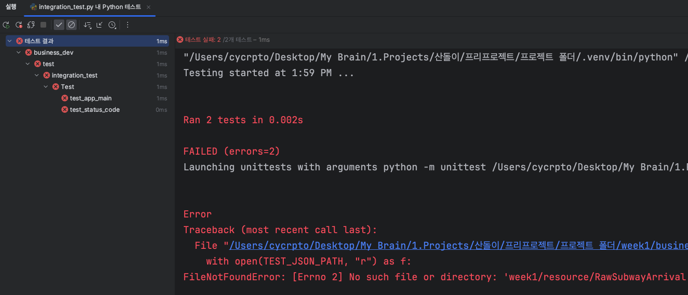

# 미션
---
## 개발자
### 개발자 공통 요구사항
- 모든 미션은 Jetbrains의 Pycharm을 기준으로 구현되어있다.
- 기능을 구현하기 전 `docs/README.md`에 구현할 기능 목록을 정리해 추가한다.
**- `requirement.txt`에서 제공된 라이브러리만 사용하여 개발해야 한다.**
	- [PyCharm에서 requirement.txt 다운로드 하는 방법](https://www.jetbrains.com/help/pycharm/managing-dependencies.html#revert-ignored)
	- [Requirement.txt 사용법](https://engineer-mole.tistory.com/258)
- 파이썬 버전 3.7 이상에서 실행 가능해야 한다.
- 기능요구사항에 있는 모든 기능을 구현하여야 한다.
- 제출 전 테스트 파일에 있는 모든 테스트를 통과하여야 한다.
	- [PyCharm에서 테스트를 실행하는 방법](https://www.jetbrains.com/help/pycharm/testing-your-first-python-application.html#write-test)
	- [Python unittest 라이브러리 docs](https://docs.python.org/ko/3/library/unittest.html)
- **요구사항에 없는 기능은 스스로 판단하여 구현한다.**
- API 개발 미션에 한하여 `utility/Frozen`사용이 가능하다. 사용법은 해당 문서 최 하단에 있다.

### API 개발
#### 요구사항
- 산돌이에서는 통학하는 학생들을 위해 지하철 도착정보를 알려주고 있다. 기능개발팀에서 서울시 공공데이터포털의 오픈API를 가공하여 API 개발팀에게 넘겨주었다. 가공된 JSON데이터는 `/resource/subway`에 저장되어있으며 학생들이 보기 편하도록 데이터를 가공하여 kakao-i openbuilder에서 요구하는 형식(텍스트)로 JSON 데이터를 가공하여 출력한다.
- 중복되는 JSON Wrapper의 경우 따로 처리할 방법을 고민한다.

#### 입력 예시
```json
{
  "result": {
    "당고개행 - 신길온천방면": [
      "전역 도착"
    ],
    "오이도행 - 오이도방면": [
      "정왕 진입"
    ],
    "왕십리행 - 신길온천방면": [
      "[10]번째 전역 (송도)"
    ],
    "인천행 - 오이도방면": [
      "[3]번째 전역 (초지)"
    ]
  }, "status": "success"}
```

#### 출력 예시
```json
{
    "version": "2.0",
    "template": {
        "outputs": [
            {
                "simpleImage": {
                    "imageUrl": "https://t1.kakaocdn.net/openbuilder/sample/lj3JUcmrzC53YIjNDkqbWK.jpg",
                    "altText": "<<이하 텍스트 예시>>"
                }
            }
        ]
    }
}
```

#### 출력 예시2
- 유효하지 않은 디렉터리 또는 값을 받아오지 못하는 경우 다음과 같은 오류 메시지를 출력한다.
```json
{"error" : "[Error] 데이터를 받아오지 못했습니다."}
```

#### 텍스트 예시
```text
현재 정왕역의 열차 도착 정보를 알려드릴게요!
[당고개행 - 신길온천방면] : 전역 도착 
[왕십리행 - 신길온천방면] : [10]번째 전역 (송도) 
[오이도행 - 오이도방면] : 정왕 진입
[인천행 - 오이도방면] : [3]번째 전역 (초지)
```


---
### 기능 개발
#### 요구사항
- 산돌이에서는 통학하는 학생들을 위해 지하철 도착정보를 알려주고 있다. 서울시 공공데이터 포털의 서울시 지하철 실시간 도착정보 API에서 필요한 데이터만 가공하여 API 개발팀에게 넘겨주어야 한다. api 문서를 상세하게 살펴본 뒤, 정왕역에 대한 열차 도착정보를 아래의 출력예시와 같이 가공하여 출력예시와 같이 출력한다.
  
- [api 문서](https://data.seoul.go.kr/dataList/OA-12764/A/1/datasetView.do;jsessionid=D9ED846C6FAE11DA9A24DE7F95AC4FD5.new_portal-svr-21) 는 다음을 참조한다.

- 만약 데이터를 받아올 수 없다면 "[Error] 데이터를 받아오지 못했습니다."를 출력한다.

>[!hint] 힌트
>- status 코드가 200이면 성공 500 또는 다른것이면 실패라고 판단해도 좋다.

#### 입력 예시
```text
크롤링 된 api json을 이용한다.
```

#### 출력 예시
```json
{
  "result": {
    "당고개행 - 신길온천방면": [
      "전역 도착"
    ],
    "오이도행 - 오이도방면": [
      "정왕 진입"
    ],
    "왕십리행 - 신길온천방면": [
      "[10]번째 전역 (송도)"
    ],
    "인천행 - 오이도방면": [
      "[3]번째 전역 (초지)"
    ]
  }, "status": "success"}

```

#### 출력 예시2
```json
{"error" : "[Error] 데이터를 받아오지 못했습니다."}
```

## 마케터
#### 요구사항
- 산돌이는 kakao i openbuilder로 제작되어 있습니다. 이는 챗봇 관리자들이 간편하게 챗봇의 기능을 만들 수 있도록 구성되어있습니다.
- 오픈빌더는 크게 시나리오탭과 스킬탭으로 구성되어있는데 시나리오에서 산돌이의 기능 블록을 만들 수 있습니다.
- 예를들어 산돌이에 `셔틀`이라는 발화를 하면 봇 응답을 지정할 수 있습니다.
- 즉, 정적인 컨텐츠를 만드는데 사용됩니다.
- 스킬탭은 동적인 컨텐츠를 만드는데 사용됩니다. 웹서버와 연동하여 개발자가 응답을 자유롭게 생성할 수 있습니다.

초대해드린 [테스트 봇](https://i.kakao.com/bot/5ff710328c008e4e081b2f92/intent/new?scenarioId=default)을 산돌이와 최대한 비슷하게 시나리오 및 블럭을 구성하면 됩니다.


---
# 제출 방법
- 제출 마감 기한은 1월 26일 금요일 오후 17:00까지이다.
- 레포지토리를 fork 하여 가져온 뒤, `1-{name}`으로 브랜치를 생성하여 개발한다.  
- 과제 완료시 pr을 날려 과제를 제출한다.

# 기타
## 테스트 실행방법
- business에 대한 테스트는 `\tests\test\integration_test`로 지정되어 있습니다. 해당 파일을 실행시키시면 pycharm기준 하단 파이썬 콘솔에 성공/실패여부가 자세하게 나옵니다.
- api에 대한 테스트는 `\tests\api_test\FlaskTestCase`에 있습니다.
- 
- 
## Flask 실행 법
```
api_dev/의 위치에서 flask run을 실행한다.
만약 "You did not provide the "FLASK_APP" environment variable"과 같은 오류 발생시 환경변수 설정(하단)을 따른다
```

### 환경변수 설정
- https://teki.tistory.com/37
- `set FLASK_APP = app`을 실행 한뒤 서버를 실행시킨다.

## FacadeJSON
- 파이썬에서 JSON을 편하게 사용할 수 있도록 도와주는 (제작된)라이브러리
### 기존 사용법
```python
content = json.loads(f)
print(content['status'])
```

### FacadeJSON
```python
content = FacadeJSON(json.loads(f))
print(content.status)
```
